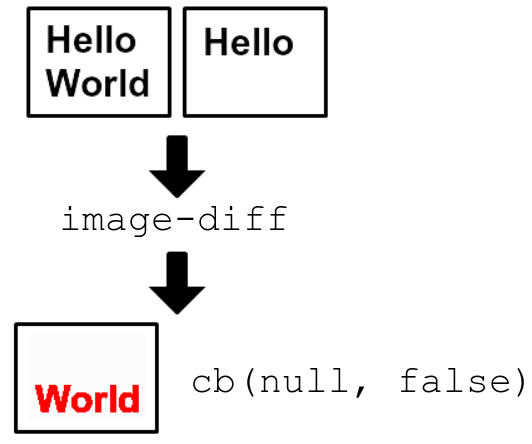

# image-diff [](https://travis-ci.org/uber/image-diff)

Create image differential between two images

This was created as part of a [visual regression][] project.

[visual regression]: http://www.youtube.com/watch?v=1wHr-O6gEfc



## Getting Started
### Requirements
`image-diff` depends on [ImageMagick][].

Please install this before continuing.

[ImageMagick]: http://www.imagemagick.org/

### Setup
Install the module with: `npm install image-diff`

```javascript
var imageDiff = require('image-diff');
imageDiff({
  actualImage: 'checkerboard.png',
  expectedImage: 'white.png',
  diffImage: 'difference.png',
}, function (err, imagesAreSame) {
  // error will be any errors that occurred
  // imagesAreSame is a boolean whether the images were the same or not
  // diffImage will have an image which highlights differences
});
```

## Documentation
`image-diff` exposes the function `imageDiff` as its export.

### `imageDiff(options, cb)`
Create an differential image between multiple images

- options `Object`
    - options.actualImage `String` - Path to actual image file
        - options.actualImage **must** exist
    - options.expectedImage `String` - Path to expected image file
        - If options.expectedImage does not exist, a transparent image with the same height/width will be created.
    - options.diffImage `String` - Optional path to output differential image
    - options.shadow `Boolean` - Optional flag to indicate if we should draw a shadow of the unchanged parts of the images
        - For example, if an image is `+` and we diff with `-`, then the image will have `|` be red but also contain a faded `-`
        - By default, this options is `false` meaning a shadow will not be drawn
- cb `Function` - Error-first function to handle diff result
    - `cb` should have the signature `function (err, imagesAreSame)`
    - err `Error|null` - If there was an error in diffing, this will be it
    - imagesAreSame `Boolean` - Indicates that images are same or not

### `imageDiff.getFullResult(options, cb)`
Same as `imageDiff` but yields a fuller result

- options `Object` - See `imageDiff#options`
- cb `Function` - Error-first function to handle diff result
    - `cb` should have the signature `function (err, result)`
    - err `Error|null` - If there was an error in diffing, this will be it
    - result `Object`
        - total `Float` - Root mean square pixel difference across all pixels
          - Value can range from 0 (no difference) to 655535 (every pixel is different)
        - percentage `Float` - Normalized total difference
          - Value can range from 0.00 (no difference) to 1.00 (every pixel is different)
        - More info here: http://www.imagemagick.org/discourse-server/viewtopic.php?f=1&t=17284

**Example:**

```javascript
var imageDiff = require('image-diff');
imageDiff.getFullResult({
  actualImage: 'checkerboard.png',
  expectedImage: 'white.png',
  diffImage: 'difference.png',
}, function (err, result) {
  // result = {total: 46340.2, difference: 0.707107}
});
```

### `imageDiff.getRawResult(options, cb)`
Same as `imageDiff` but yields raw CLI result

- options `Object` - See `imageDiff#options`
- cb `Function` - Error-first function to handle diff result
    - `cb` should have the signature `function (err, result)`
    - err `Error|null` - If there was an error in diffing, this will be it
    - result `String` - Result from ImageMagick's `compare` command
        - Example output can be found here: http://www.imagemagick.org/discourse-server/viewtopic.php?f=1&t=17284

### CLI usage
We offer an `image-diff` executable to diff from the CLI. When images match, its exit code will be `0`. When they don't match, then it will be non-zero (e.g. `1`).

```
$ image-diff --help

  Usage: image-diff [options] <actual-image> <expected-image> [diff-image]

  Options:

    -h, --help     output usage information
    -V, --version  output the version number
    --shadow       Draw a shadow of unchanges parts on diff image

```

Example usage:

```bash
# Images don't match
image-diff checkerboard.png white.png diff.png
echo $?
# 1
# We can look at `diff.png` for the diff result

# Images do match
image-diff checkerboard.png white.png
echo $?
# 0
```

## Contributing
In lieu of a formal styleguide, take care to maintain the existing coding style. Add unit tests for any new or changed functionality. Lint via [grunt](https://github.com/gruntjs/grunt) and test via `npm test`.

## Attribution
The font used for the example image is [Arial][] 30pt bold and [Courier New][] 38pt.

[Arial]: http://en.wikipedia.org/wiki/Arial
[Courier New]: http://en.wikipedia.org/wiki/Courier_%28typeface%29#Courier_New

## License
Copyright (c) 2013 Uber

Licensed under the MIT license.
